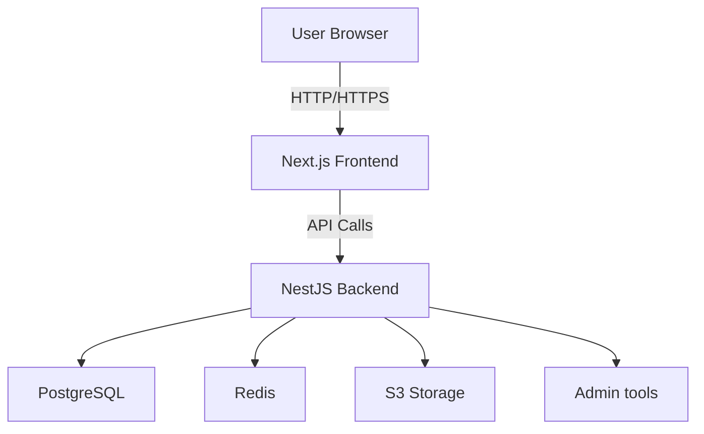

# 🏗️ Architecture Overview — TrioVie SM

## 🎯 Mục tiêu kiến trúc

- Modular, dễ scale và bảo trì
- Hỗ trợ SSR (Server-side rendering) và SEO tốt
- Realtime, event-driven (sẵn sàng mở rộng sau này)
- Tách biệt rõ ràng frontend/backend, tận dụng shared types

---

## 🗺️ High-level Architecture

